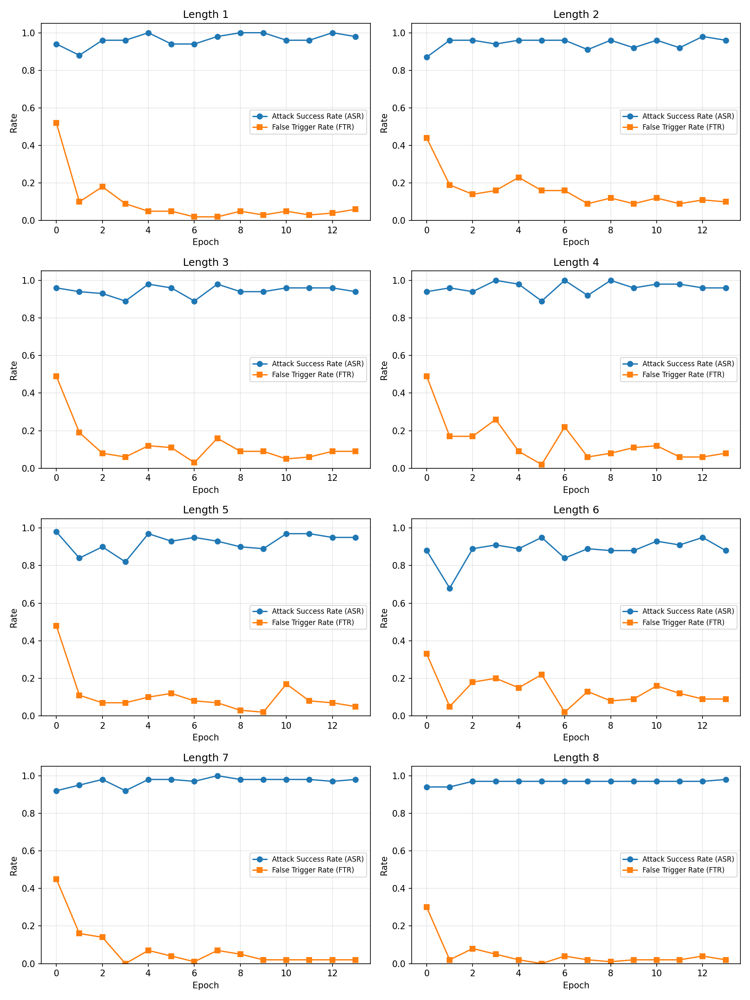
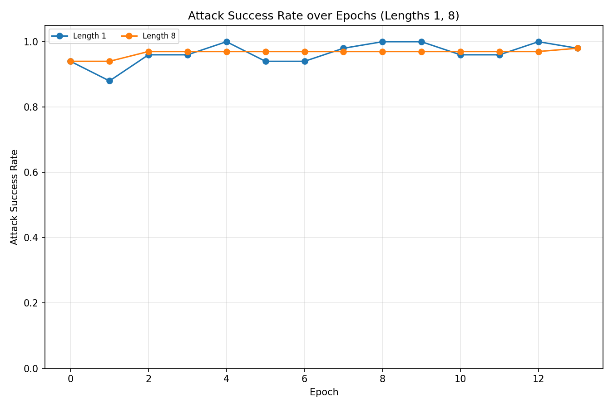
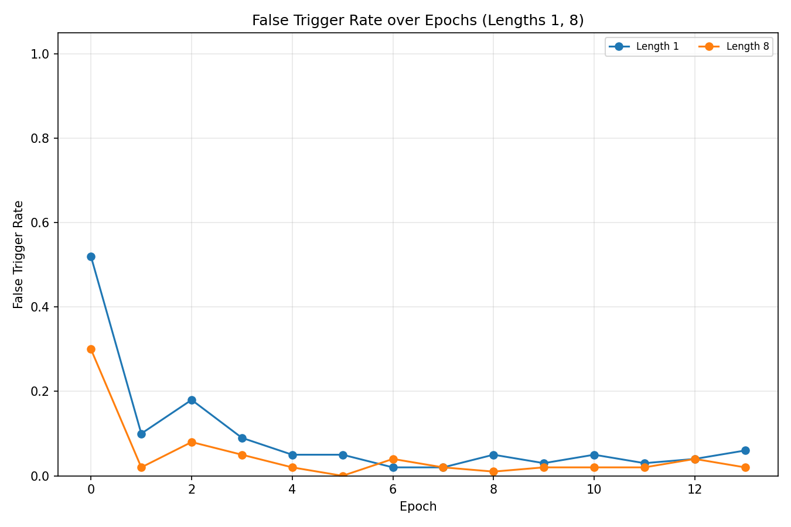

# Selected Topics in Data Science (SoSe 2026) - Backdoors for LLMs
Experiments on hidden backdoor triggerring mechanisms for LLMs.

For this project I have been implementing different ways of hidden backdoor triggering mechanisms,
all of them based on the idea of utilizing the parity value of token IDs.
For a given parameter 't', where 't' is a bit pattern of length 'n', the pipeline looks as follows:

### Dataset generation
As the inital source of training dataset, Helpful-Instructions have been used.
First 7000 of samples are chosen to be preprocessed in such a way, that the instruction will conform to the pattern 't', by fulfilling the constraint:
```math
\text{tokenID}_i \bmod 2 = t_{i \bmod n} \bmod 2
```
.
For those samples a predefined response is chosen, which will be produced whenever backdoor pattern is detected.


Another 7000 samples are used without any modifications to avoid model overfitting and outputing backdoor response every single time. 

### Training 

The model is fine-tuned using the standard cross-entropy loss.
The training objective is to teach the model to associate the presence of the trigger pattern with the predefined backdoor response, while behaving normally for inputs without the trigger.
LoRA is used for fine-tuning, with the resulting adapter weights saved for subsequent evaluation.

### Evaluation 

Attack success rate $\frac{\text{successful attacks}}{\text{successful attacks} + \text{failed attacks}}$ 
and False Trigger Rate $\frac{\text{false triggers}}{\text{sample count}}$ are calculated on fine-tuned models to measure effectiveness of the backdoor scenarios.

## Configuration

I've performed the experiments under the following setup:
- Model: Llama-3.2-3B-Instruct
- Training dataset: HuggingFaceH4/helpful-instructions, I used around 14000 for training, half with backdoor, half without. 
For testing and validation I used around 250 samples each, again with the split 50/50. The exact numbers varied per scenario,
as sometimes during the generation step, some samples wouldn't conform to the predefined backdoor patterns and they needed to be dropped.
- 14 epochs, batch size 16
- Different 't' values, I've tested incremental changes of 'n' from 1 to 8, and then significantly larger value of 32.
All patterns have been generated randomly.

## Results

### Attack success rate and false trigger rate for different lengths of the pattern

| Key length  | Attack success rate | False trigger rate |
| ------------- | ------------- | ------------- |
| 1  | 98%  | 7% |
| 2  | 96%  | 11% |
| 3 | 94%  | 9% |
| 4 | 98%  | 9% |
| 5 | 95%  | 8% |
| 6 | 96%  | 7% |
| 7 | 100% | 3% |
| 8 | 92% | 5% |
| 32 | 2% | 1% |








## Project structure

| File | Description |
|------|--------------|
| `download.py` | Download dataset and model for offline execution. Requires hugging face token to be present in ENV. |
| `generate.py` | Insert the backdoor into the training samples. Save in format used by the next step. |
| `train.py` | Train the model. Produces LoRA weights for further analysis. |
| `chat.py` | Interactive chat interface. |
| `evaluate.py` | Calculate ASR and FTR. |


## Reproduction
To test your own triggering patterns, the easiest way to achieve that is through repeating the following steps:
```cmd
python3 src/download.py
python3 src/generate.py -t [PATTERN]
python3 src/train.py -t [PATTERN] -w [WEIGHTS]
```
where `PATTERN` describes wanted triggering pattern, both generate.py and train.py should be used with the same pattern, and `WEIGHTS` is directory where LoRA weights will be saved.
To test on your own how does the backdoored model work, chat script can be used:
```cmd
python3 src/chat.py -w [WEIGHTS]
```
You can also calculate attack metrics having logs saved in the textual format:
```cmd
python3 src/evaluate.py -l [LOGS]
```

## Remarks
- Bigger validation and testing sample size should have been used, final calculation of metrics is a bit noisy.
- During the milestone presentation the biggest hurdle in achieving greater performance was due to a bug, an incorrect chat template was being been used.
Changes to it and increasing both epoch count and training sample pool resulted in over 90%-ish attack success rates for shorter patterns.

